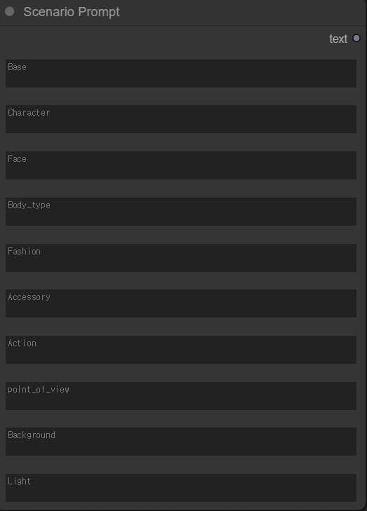
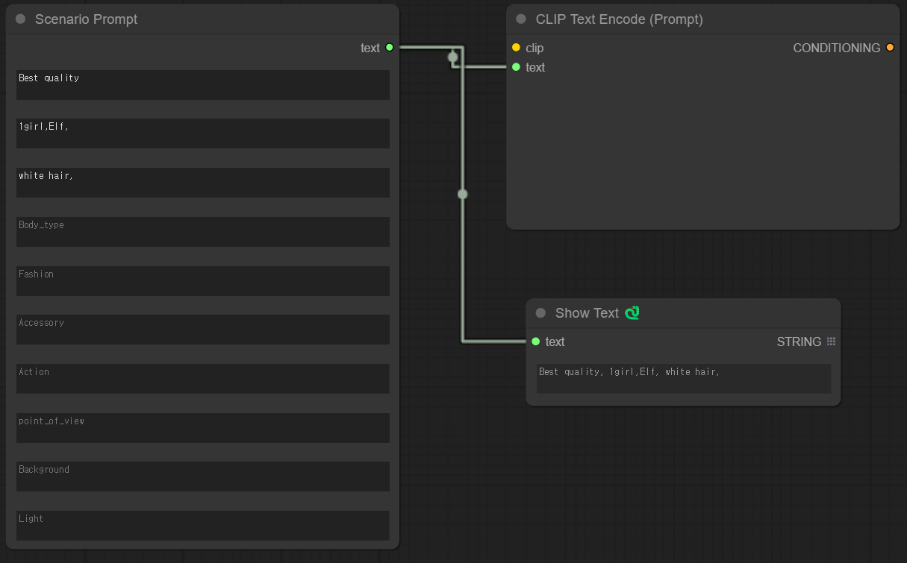

# ComfyUI-ScenarioPrompt

[](./README.ko.md)



ScenarioPrompt is a custom node that helps you understand what you're prompting for each property as you build your prompts

Currently available in 10 properties, **Base is mandatory**.



You can use it in conjunction with [CLIP Text Encode (Prompt)](https://blenderneko.github.io/ComfyUI-docs/Core%20Nodes/Conditioning/CLIPTextEncode/), or you can use the Show Text item in [ComfyUI-Custom-Scripts](https://github.com/pythongosssss/ComfyUI-Custom-Scripts) to line up the prompts entered.

⚠️ To connect ScenarioPrompt to a prompt, you must check the **Convert text to input** box for CLIP Text Encode (Prompt).

](data/static/Scenario_prompt_caution.png)

## Installation

```bash
cd path/to/comfyui/custom_nodes/
```

```bash
git clone https://github.com/Ludobico/ComfyUI-ScenarioPrompt.git
```

## Autocomplete

It was inspired by the two source codes above: [ComfyUI - CustomNode Unlimited Prompt](https://github.com/PluMaZero/ComfyUI-SpaceFlower) and [NovelAI.app](https://github.com/gangjun06/NovelAI.app).

The tags used for autocomplete are also based on NovelAI.app's googlesheet.

](data/static/ScenarioPrompt_autocomplete.gif)

## Reference

https://github.com/gangjun06/NovelAI.app

https://github.com/PluMaZero/ComfyUI-SpaceFlower
